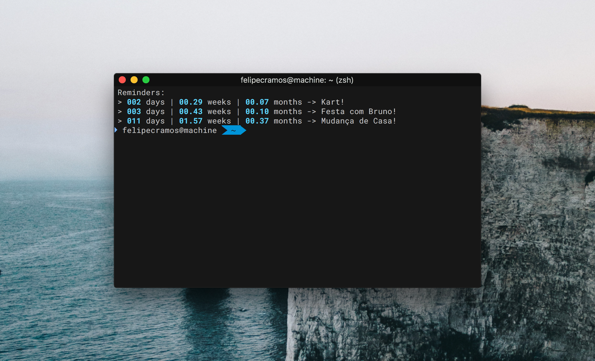

# Reminder for Terminal
A simple reminder for all the shell users that may want to remember a special date ~~or deadline~~.





## Tips for usage
I made this script just to put on my `.zshrc` file, so every time it starts a new terminal window, it appears the reminder of that particular event!

You can put it too by editing the `.zshrc` or `.bashrc` or anything savage that you might use, just put:
```bash
/usr/bin/env python3 countdown.py DD/MM/YYYY [Title of the event]
```
Or, if you `chmod 775` the `countdown.py` file, you can run by:

```bash
./countdown.py DD/MM/YYYY [Title of the event]
```

_Note: this examples hopes that you have python3 correcly specified on your env path._


# Authorship

This little script was developed by FelipeCRamos, under the **MIT** license.